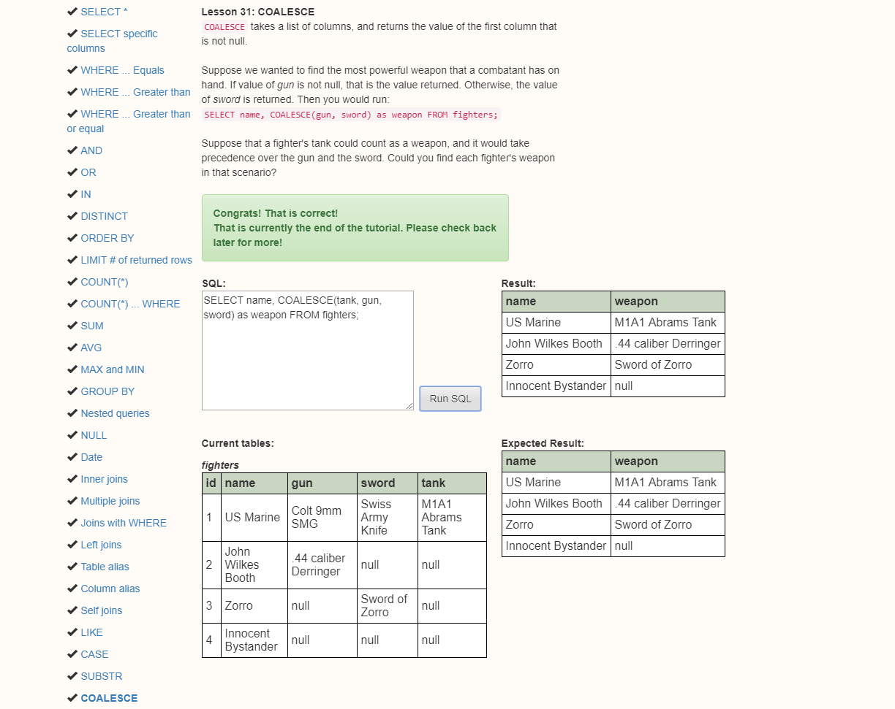

SQL training completion:




```{r}

### Connect to the database
library(RMySQL)
con2 <- dbConnect(MySQL(),
                 user = 'trial',
                 password = 'password',
                 host = '127.0.0.1',
                 dbname='titanic')
```

```{r, eval = FALSE}

### Load Titanic Data
titanic <- read.table("/home/php2560/titanic.csv", header=TRUE, sep=",")


### Creat Table in MySQL
dbWriteTable(con2, "titanic_morin", titanic)

```

```{r}

### Test "Show Table" query
query = "show tables;"
dbGetQuery(con2, query)

```

```{r}

### Test "describe" query
query2 = "describe titanic_morin"
dbGetQuery(con2, query2)

```

```{r}
### Test "select" query

query3 = "select name, pclass, age, sex from titanic limit 10"
dbGetQuery(con2, query3)

```

### 1. Run the following SQL command. Before doing so describe what this is asking:

The following query selects pclass and survived from my titanic database. It then groups by pclass. Then, within each pclass, it groups by survived. Then, for each of the 6 groups it calculates the average age, which is displayed in the avg_age column. 


```{r}

query4 = "select pclass, survived, avg(age) as avg_age from titanic_morin  
          group by pclass, survived;"

dbGetQuery(con2, query4)

```

### 2. Run the following SQL command. Before doing so describe what this is asking:

The following query selects the pclass and survived from my titanic database. It then groups by pclass. Then, it selects the rows where survived = 1. Then for each pclass it calculates the average age and displays the age in the avg_age column. 


```{r}

query5 = "select pclass, survived, avg(age) as avg_age from titanic_morin
          where survived=1
          group by pclass, survived;"

dbGetQuery(con2, query5)

```

### 3. Run the following SQL command. Before doing so describe what this is asking:

The following query selects name, pclass, survived, and age colums from my titanic db. The then filters rows such that the name matches the regular expression : START %R% ANYCHAR %R% 'sen' %R% one_or_more(ANY_CHAR). 

```{r}

query6 = "select name, pclass, survived, age from titanic_yourlastname 
          where name regexp '^.sen.+';"

dbGetQuery(con2, query6)

```

### 4. Run the following SQL command. Before doing so describe what this is asking:

The following query selects name, pclass, survived, and age columns from my titanic db. Then, it filter rows where the name column matches the regular expression pattern: 'Jakob' %R% zero_or_more(ANY_CHAR) %R% END.

```{r}

query7 = "select name, pclass, survived, age from titanic_morin
          where name regexp 'Jakob.*$';"

dbGetQuery(con2, query7)

```

### 5. Run the following SQL commands. What is different about them? What do they return?

Both queries select name, pclass, survived, and age from my titanic db. Both queries filter rows by matching a regular expression in the name column. The first query (query8) matches a name where "Ivar" appears anywhere. The second query (query9) matches a name when "Ivar" is matched anywhere after a comma. 

```{r}

query8 = "select name, pclass, survived, age from titanic_morin 
          where name regexp 'Ivar.*$';"

query9 = "select name, pclass, survived, age from titanic_morin
          where name regexp ',.*Ivar.*$';"

dbGetQuery(con2, query8)
dbGetQuery(con2, query9)

```

### More Challenging 1:

Create a data frame with:

pclass
sex
age
fare
survived
parch 

Only for people who did not survive.

```{r}

query10 = "select pclass, sex, age, fare, survived, parch from titanic_morin where survived=0;"

dfdiedbyclass = dbGetQuery(con2, query10)

dfdiedbyclass

```

### More Challenging 2:

Create a graph of the average survival over the different classes. Make two distinct lines for male and female passengers. Create this plot using ggplot.

```{r}

library(ggplot2)
library(dplyr)


query11 = "select pclass, sex, avg(survived) as avg_survived from titanic_morin  
          group by pclass, sex;"

dfsurvbyclass = dbGetQuery(con2, query11)

dfsurvbyclass %>%
  filter(complete.cases(dfsurvbyclass)) %>%
  ggplot(aes(x = pclass, y = avg_survived)) +
  geom_line(aes(color = sex), size = 2) +
  xlab("Passenger Class") +
  ylab("Proportion who Survived") +
  theme_minimal() +
  theme(legend.position = c(0.85, 0.85)) +
  labs(color = "Sex") +
  ggtitle("Average Survival by Class, Sex")

```

As we can see from the graph, passenger survival is lower among those in the lower class. Survival among men is also lower when compared to the rates among women. 